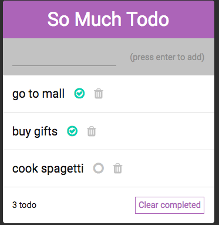

## TODO APP USING REACT

## How to Clone and Run

- git clone https://github.com/phinchik/todo-app-react
- cd todo-app-react
- npm install
- npm start

## Features:

- Add a new Todo
- Remove a specific Todo item by clicking the trash bin
- Toggle single or multiple Todo
- Delete all Toggled Todo
- Number of items is generated dynamically

## Author

- Jenny Gutierrez

## Technologies Used

- React

## Preview

